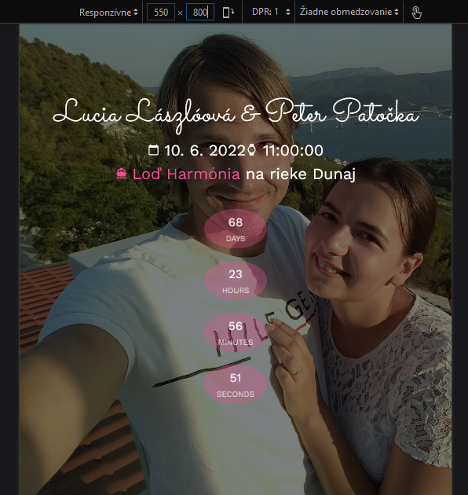

# Wedding page

* React - frontend application
* PHP - to support backend api
* MySQL - to store data



## Frontend development

In the project directory, you run:

```
./run.sh install
```

Then you can start application:

```
./run.sh start_dev
```

Runs the app in the development mode.<br />
Open [http://localhost:3000](http://localhost:3000) to view it in the browser.

The page will reload if you make edits.<br />
You will also see any lint errors in the console.

## Backend development

All backend scripts are located in folder `/api/`. To start PHP server in docker container, use:

```
./run.sh backend_up
```

Server is available on url [http://localhost:8001/api/](http://localhost:8001/api/).

To edit data, use [phpmyadmin](http://localhost:8000/) with user name `username` and password `password`.

### Close all containers

To destroy all running docker containers use `./run.sh backend_down`.

## Run unit tests

`./run.sh test` launches the test runner in the interactive watch mode.

## CI/CD

This repository uses [GitHub Actions](https://docs.github.com/en/actions) to automate deployments and [GitHub Pages](https://docs.github.com/en/pages) for hosting static files.

## Deployment to production

Application is expected to be deployed to the `/wedding/` folder. Current production URL is: [http://patocka.sk/wedding/](http://patocka.sk/wedding/) 

`./run.sh build` builds the app for production to the `build` folder.<br />
It correctly bundles React in production mode and optimizes the build for the best performance.

The build is minified and the filenames include the hashes.<br />
Your app is ready to be deployed!

### Deployment consists of these steps:
1. run all database migration in folder `/api/db/`
2. setup database connection in file `/api/db.php`
3. copy `build/` content to document root
4. copy `/api/` content to `/api/` folder

## Happily Ever After

```java
/**
 * Execute wedding day. The bride and the groom will live together, as a married couple.
 *
 * Wedding day: 📅 10. 6. 2022, 11:00
 * Location: ⛴ Loď Harmónia, Fajnorovo nábrežie 2, Bratislava
 *
 * @see <a href="http://patocka.sk/wedding/">Wedding page</a>
 */
public void wedding() {
    if (acceptWedding(groom) && acceptWedding(bride)) {
        groom.setMarried(bride);
        bride.setMarried(groom);

        try {
            liveHappilyEverAfter(bride, groom);
        } catch (PersonDiedException personDiedException) {
            Person personWhoDied = personDiedException.getPerson();

            throwStuffToBin(personWhoDied);

            if (personWhoDied == groom || personWhoDied == bride) {
                groom.setMarried(null);
                bride.setMarried(null);
            }
        }
    } else {
        new Thread(() -> doSomething(bride)).start();
        new Thread(() -> doSomething(groom)).start();
    }
}
```
